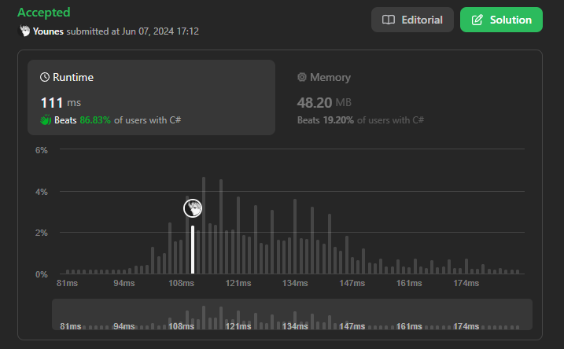

# Solution

```cs
using System.Collections.Generic;
int[] TwoSum(int[] nums, int target) {
    var seen = new Dictionary<int, int>();
    for(int i = 0; i < nums.Length; i++) {
        int diff = target - nums[i];
        if (seen.ContainsKey(diff)) return [seen[diff], i];
        else seen[nums[i]] = i;
    }
    return [];
}
```


